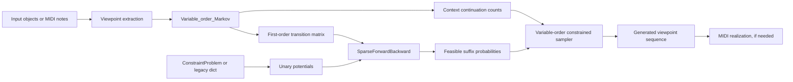

# Current Continuator Architecture

This document describes the current "classic" Continuator implementation. It is
intended as a quick orientation guide for contributors and future coding-agent
sessions before any larger context-BP redesign.

## Big Picture

The current system combines three layers:

1. A generic variable-order Markov model over arbitrary viewpoints.
2. A sparse first-order finite-chain solver for positional constraints.
3. A MIDI application layer that converts notes to viewpoints, generates
   viewpoint sequences, and realizes them back into MIDI notes.

The current constrained sampler does not run inference on the full variable-order
state space. Instead, it:

1. Builds a first-order transition matrix over viewpoints.
2. Runs sparse forward-backward inference with unary positional constraints.
3. Samples using variable-order contexts, filtered by the feasible first-order
   suffix information from the chain solver.

This is the central design fact to remember when comparing the current engine
with a future exact context-BP engine.



## Package Map

The repository currently uses `ctor` as its import package.

| Path | Role |
| --- | --- |
| `ctor/classic/variable_order_markov.py` | Generic classic variable-order Markov model, learning, constrained sampling, decay modes, compatibility behavior. |
| `ctor/classic/continuator.py` | MIDI-facing classic facade; exports `ClassicContinuator` and compatibility `Continuator2`. |
| `ctor/context_bp/` | Experimental context-BP implementation: generic model, inference, vocabulary, and MIDI facade. |
| `ctor/context_bp/order_policy.py` | Context-BP sampling policies, including longest-feasible and classic singleton-avoidance backoff. |
| `ctor/core/` | Compatibility wrappers for the old context-BP core import path. |
| `ctor/engines.py` | Small generic engine-selection adapters for comparing classic and context-BP models. |
| `ctor/chain_solver.py` | Sparse forward-backward solver for finite first-order Markov chains. |
| `ctor/constraints.py` | Small positional constraint builder and helpers for legacy dict constraints. |
| `ctor/continuator.py`, `ctor/variable_order_markov.py` | Compatibility aliases for classic implementation imports. |
| `ctor/context_bp_continuator.py` | Compatibility wrapper for the context-BP MIDI facade. |
| `ctor/midi/` | Shared MIDI/viewpoint/realization utilities for MIDI-facing facades. |
| `midi_stuff/mini_muse.py` | Lightweight `Note` representation used by the MIDI layer. |
| `ctor/ui/gradio_app.py` | Local Gradio UI around `Continuator2`. |
| `ctor/continuator_gradio.py` | Compatibility entry point for the Gradio UI. |
| `ctor/phrase_listener.py` | Realtime MIDI phrase capture/playback helper. |
| `ctor/legacy/dynaprog.py` | Legacy variable-domain sequence optimizer, currently optional/experimental for realization. |
| `ctor/legacy/markov_analysis.py` | Legacy Markov-chain diagnostics such as irreducibility and stationary distribution. |
| `ctor/dynaprog.py`, `ctor/markov_analysis.py` | Compatibility wrappers for the legacy helper modules. |
| `ctor/belief_propag.py` | Compatibility exception only; the old generic BP graph implementation has been removed. |
| `examples/` | Basic examples for ints, chars, words, chord sequences, and notes. |
| `examples/compare_classic_context_bp_midi.py` | MIDI comparison script for classic vs context-BP generations. |
| `tests/test_chain_solver.py` | Current regression tests for sparse inference and high-level sampling behavior. |
| `tests/test_public_api.py` | Compatibility tests for the public API used by external front ends. |

## Core Classes

### `Variable_order_Markov`

Defined in `ctor/classic/variable_order_markov.py`.

This is the main generic model. It can learn sequences of arbitrary Python
objects. If `vp_lambda` is `None`, objects are their own viewpoints. Otherwise,
`vp_lambda(obj)` maps each input object to a viewpoint.

Main responsibilities:

- Maintain the viewpoint vocabulary.
- Add start and end padding sentinels around each learned sequence.
- Store variable-order context continuation counts for orders `1..kmax`.
- Optionally store realization addresses for viewpoints.
- Build the first-order transition matrix used by constrained inference.
- Expose fixed-length and until-end generation APIs.
- Combine the first-order chain solver with variable-order sampling.
- Maintain optional exponential-decay count views: `full`, `late`, `middle`,
  and `early`.

Important internal fields:

- `all_unique_viewpoints`: index-to-viewpoint list.
- `vp2index`: viewpoint-to-index dictionary.
- `ctx_to_continuations`: maps a context tuple of viewpoints to a
  `MultiCounter` whose keys are next-viewpoint integer ids.
- `viewpoints_realizations`: maps viewpoints to source addresses when
  realization storage is enabled.
- `first_order_matrix`: cached order-1 transition matrix in `full` mode.
- `start_padding`, `end_padding`: unique sentinel objects used as sequence
  boundaries.

The current implementation mixes model storage, sampling, fallback policy, and
some user-facing compatibility concerns. This is useful for continuity but is
also the main pressure point for future refactoring.

### Generic Engine Adapters

Defined in `ctor/engines.py`.

`ClassicSequenceEngine` and `ContextBPSequenceEngine` provide a small shared
interface for generic sequence experiments:

- `learn_sequence`
- `sample_sequence`
- `continue_sequence`
- `continue_until_end`

Use `make_sequence_engine("classic")` or
`make_sequence_engine("context_bp")` when comparing the two generic models.
`ClassicContinuator` is the classic MIDI facade; `Continuator2` remains as a
compatibility name for existing clients.

### `LazyExpCounter` and `MultiCounter`

Defined in `ctor/variable_order_markov.py`.

`LazyExpCounter` stores exponentially decayed per-key weights without updating
all keys at every time step. `MultiCounter` wraps exact counts plus fast and
slow decayed counters. This supports four read modes:

- `full`: exact historical counts.
- `late`: fast-decayed recent counts.
- `middle`: slow minus fast, emphasizing intermediate-age material.
- `early`: full minus slow, emphasizing older material.

The decay mode affects transition weights and invalidates the first-order matrix
cache.

### `SparseForwardBackward`

Defined in `ctor/chain_solver.py`.

This solver performs sum-product inference on a first-order finite Markov chain.
Its transition matrix convention is:

```text
P[previous_state, next_state]
```

Unary potentials have shape `(length, vocab_size)`. Hard positional constraints
are one-hot rows. Forbidden values have zero weight.

Main methods:

- `forward_backward(unary_potentials)`: returns normalized marginals plus
  forward/backward messages.
- `reachable_to_target(target_index, max_steps)`: exact-step reachability.
- `first_hit_reachable_to_target(target_index, max_steps)`: reachability where
  the target is first hit at the specified step.

The solver is iterative and sparse over non-zero matrix entries. It replaced the
old generic recursive BP graph.

### `ConstraintProblem`

Defined in `ctor/constraints.py`.

This is a small builder for positional constraints:

```python
constraints = ConstraintProblem(length=20)
constraints.at(0).equals(start_viewpoint)
constraints.at(10).one_of([a, b, c])
```

Constraints are always indexed over the generated sequence returned by the API,
not over the prefix plus generated material.

Legacy dict constraints are still supported:

```python
constraints = {0: start_viewpoint, 19: end_viewpoint}
```

`ConstraintProblem` can represent one-of constraints. The legacy dict format can
only represent single-value equality constraints.

### `ClassicContinuator` and `Continuator2`

Defined in `ctor/classic/continuator.py`.

`ClassicContinuator` is the MIDI-facing facade for the classic engine. It owns
a `Variable_order_Markov` whose viewpoint function maps each `Note` to:

```python
(pitch, duration_bin, overlaps_left, overlaps_right)
```

Main responsibilities:

- Read MIDI files and convert them to `Note` sequences.
- Learn phrases and optional transpositions.
- Expose high-level generation methods:
  - `sample_sequence`
  - `continue_sequence`
  - `continue_until_end`
- Realize generated viewpoints back into concrete notes.
- Save generated note sequences as MIDI files.
- Maintain practical UI settings such as forgetting old phrases, transposition,
  generation length, and decay mode.

`Continuator2` is a compatibility subclass of `ClassicContinuator`. Existing
front ends should continue importing `Continuator2`; new code can use the more
explicit `ClassicContinuator` name.

Neither class is the generic model. They are application layers over the
classic generic model.

See `docs/public_api.md` for the compatibility surface that should remain
stable for external clients such as `continuator_front`.

### `ContextBPContinuator`

Defined in `ctor/context_bp/continuator.py`.

This is the first MIDI-facing experiment using the new context-BP core. It no
longer subclasses `Continuator2`; instead it uses shared MIDI helpers from
`ctor.midi` and learns each phrase into two stores:

- `context_model`: `ContextBPModel` used for viewpoint generation.
- `vom`: classic `Variable_order_Markov` used for viewpoint realizations.

This keeps the external `Continuator2` API unchanged while giving the new core
a practical MIDI test path. The generic context-BP model defaults to the
longest feasible context policy, while this MIDI facade uses the classic-style
singleton-avoidance policy by default. The context-BP facade can expose the
last generation trace so external clients can inspect selected orders and
singleton backoffs. For memory-only fixed-length generation, it uses a
free-initial context mode rather than forcing the hidden START context; prompted
continuation still uses the given prefix as conditioning context.

### `MidiContinuatorBase`

Defined in `ctor/midi/base.py`.

This contains shared MIDI application behavior such as MIDI file parsing,
MIDI-message conversion, phrase metadata, default note viewpoints, transposition,
and viewpoint realization back to `Note` objects. It is intentionally model
agnostic: concrete facades supply the learning and generation engine.

### `Note`

Defined in `midi_stuff/mini_muse.py`.

`Note` is the current musical event representation. It stores:

- pitch
- velocity
- duration
- start time
- deltas to neighboring notes

The overlap-related deltas are used by `Continuator2.get_viewpoint` and by the
realization/timing logic to preserve simple polyphonic status.

## Learning Flow

For a learned sequence, `Variable_order_Markov.build_vo_markov_model` performs
these steps:

1. Convert each input object to a viewpoint.
2. Add start and end padding sentinels:

   ```text
   [START] + viewpoints + [END]
   ```

3. Register unseen viewpoints in `vp2index` and `all_unique_viewpoints`.
4. Count non-padding viewpoint occurrences for zero-order priors.
5. Store realization addresses if enabled.
6. For each next token, update every suffix context of length `1..kmax`.
7. Add an `END -> END` self-transition so the end row is not empty.
8. Invalidate the cached first-order transition matrix.

For identity viewpoint models, realization storage is disabled by default
because generated viewpoints are already the realized objects. For computed
viewpoint models such as MIDI, realization storage is enabled by default.

## Generation APIs

### `sample_sequence`

Generates a fixed-length sequence. If no prefix is supplied, constraints are
applied directly to the returned sequence.

### `continue_sequence`

Generates a fixed-length continuation after a prefix. The prefix is conditioning
context only and is not included in the returned sequence.

Because the chain contains an extra fixed first variable during prefix
conditioning, continuation constraints are shifted internally by one.

### `continue_from_viewpoint`

Generates after an explicit hidden handoff viewpoint. This mainly exists for
API compatibility with external front ends.

### `continue_until_end`

Generates a variable-length continuation that first hits the end viewpoint
within a length window. It uses first-hit reachability over the first-order
chain, then samples with the same variable-order filtering strategy.

## Constrained Sampling Flow

For fixed-length constrained generation, the current path is:

1. Compile positional constraints into unary potentials over viewpoint indices.
2. For unconstrained positions, forbid `START` and `END` by default.
3. Let explicit constraints override those default forbidden values.
4. Run `SparseForwardBackward` on the first-order transition matrix.
5. Sample the first value from the first marginal, unless a hidden first
   viewpoint was supplied.
6. For each next position:
   - use the current first-order row;
   - multiply by the unary potential and backward message for the suffix;
   - ask the variable-order sampler for the highest-order continuation whose
     next viewpoint remains feasible;
   - fall back to first-order feasible sampling if no variable-order
     continuation survives.
7. Verify that the returned sequence satisfies the original constraints.

This guarantees the returned sequence satisfies the positional constraints when
a sequence is returned. It does not mean inference was exact under the full
variable-order context model.

## Fallback and Relaxation Behavior

Some public methods optionally relax generation when strict continuation fails:

- `relax_prefix_on_fail`: retry without the full prefix context.
- `relax_pos0_on_fail`: drop a hard constraint at generated position 0.
- `raise_on_fail`: raise `NoSolutionErrorInBP` instead of returning `None`.

These policies are part of the current public behavior. They are useful for live
interaction, where returning something can be preferable to failing strictly.

## Important Invariants and Conventions

- `all_unique_viewpoints[index]` and `vp2index[viewpoint]` must remain inverse
  mappings.
- First-order transition matrices use rows as previous states and columns as
  next states.
- `ctx_to_continuations` uses context tuples of viewpoint objects, but stores
  continuation keys as integer viewpoint ids.
- `START` and `END` are excluded from unconstrained positions by default.
- Explicit constraints may force `START` or `END`.
- Constraints are indexed over returned generated material, not over hidden
  prefix state.
- `NoSolutionErrorInBP` is a compatibility exception name. The current solver
  error is `NoSolutionErrorInChainSolver`.
- Randomness currently comes from a mixture of `random.Random`, module-level
  `random`, and `numpy.random`.

## Known Design Pressure Points

These are not necessarily bugs, but they matter for future work:

- `Variable_order_Markov` has too many responsibilities.
- The constrained solver is first-order, while the sampler is variable-order.
- The model uses arbitrary Python viewpoint objects in context keys, which is
  convenient but keeps hashing in important paths.
- Realization storage is tied to the model class rather than a separate
  realization layer.
- MIDI parsing, viewpoint design, generation policy, and rendering still live
  in or near `Continuator2`.
- Some diagnostic behavior still uses `print`.
- The public API keeps several compatibility paths that are useful but make the
  core harder to read.

These are the main reasons a future context-BP core should be built beside this
classic implementation rather than by heavily editing it in place.

## Suggested Future Boundary

A future exact variable-order/BP redesign should probably preserve the current
classic engine and add a new core with these boundaries:

- vocabulary and viewpoint ids
- variable-order context model
- compiled sparse context-state prediction graph
- constraint compilation
- forward-backward inference over context states
- exact constrained sampler
- separate MIDI realization layer

The current implementation should then remain available as the classic engine
for comparison, compatibility, and musical regression testing.

The first experimental version of this new core is documented in
`docs/context_bp_design.md`.
